# Frontend Slides

A coding-agent skill for creating stunning HTML presentations — from scratch or by converting PowerPoint files. It is packaged as a Claude Code plugin, and the core `SKILL.md` can also be read by other coding agents with filesystem and shell access.

> **Fork note —** This is a fork of [@zarazhangrui](https://github.com/zarazhangrui)'s [frontend-slides](https://github.com/zarazhangrui/frontend-slides). It adds a personal **`kj-template-pack`** — custom design-system templates that plug into the same style-discovery flow. The previews below are made with this fork.

## What This Does

**Frontend Slides** helps non-designers create beautiful web presentations without knowing CSS or JavaScript. It uses a "show, don't tell" approach: instead of asking you to describe your aesthetic preferences in words, it generates visual previews and lets you pick what you like.

Here are the authored templates added in this fork: **Redline**, **Duolingo Learn**, **Stagehand Dev**, **Hedgehog OS**, **Voltcast**, and **Twenty SaaS**.

<p>
  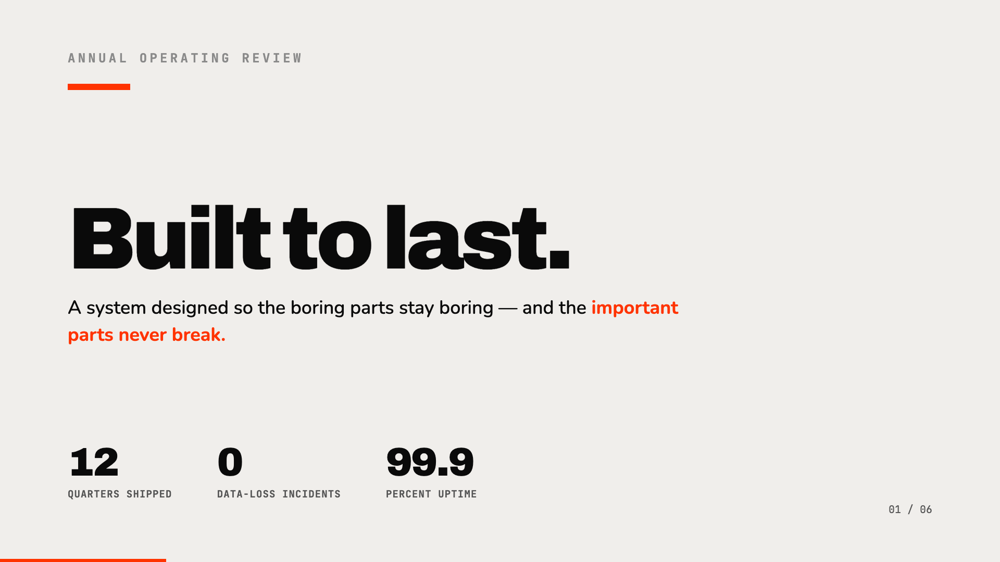
  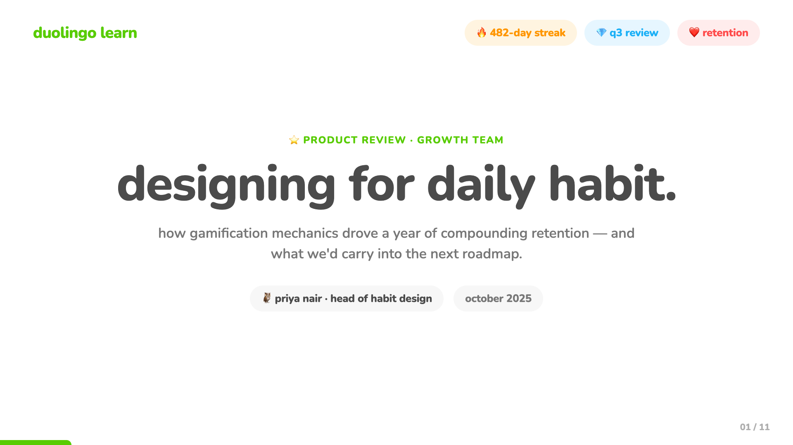
  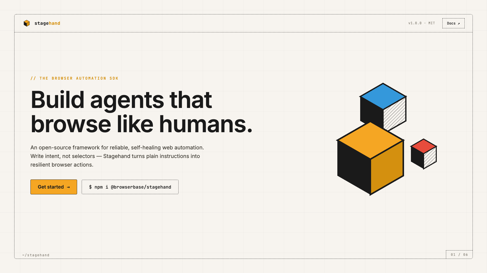
</p>
<p>
  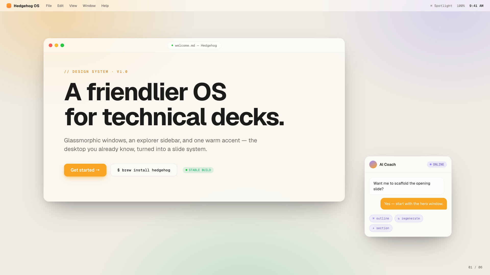
  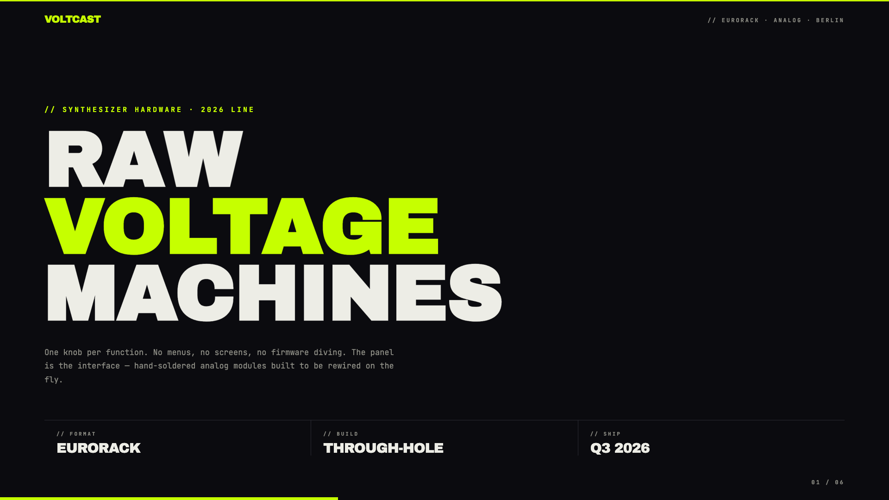
  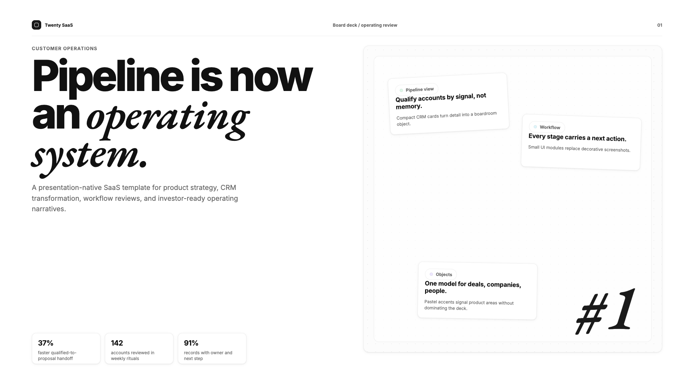
</p>

### Key Features

- **Zero Dependencies** — Single HTML files with inline CSS/JS. No npm, no build tools, no frameworks.
- **Visual Style Discovery** — Can't articulate design preferences? No problem. Pick from generated visual previews.
- **PPT Conversion** — Convert existing PowerPoint files to web, preserving all images and content.
- **Anti-AI-Slop** — Curated distinctive styles that avoid generic AI aesthetics (bye-bye, purple gradients on white).
- **Template Packs** — Optional design-forward templates from `beautiful-html-templates` plus this fork's `kj-template-pack`, loaded progressively so safe presets still work as the default fallback.
- **Production Quality** — Accessible, fixed 16:9, well-commented code you can customize.

## Installation

### Via Claude Code Custom Marketplace Source

Install directly from this public GitHub repo. Run these as two separate Claude Code messages; do not paste both lines into the prompt at once.

```text
/plugin marketplace add https://github.com/kev-hu/frontend-slides
```

After that finishes, run:

```text
/plugin install frontend-slides@frontend-slides
```

Use the HTTPS URL. The shorter `kev-hu/frontend-slides` form may make Claude Code try SSH, which can fail if GitHub is not already in your `known_hosts` file.

Then use it by typing `/frontend-slides:frontend-slides` in Claude Code. Claude Code namespaces plugin-installed skills as `/plugin-name:skill-name`.

### Claude Code Manual Installation

Copy the skill files to your Claude Code skills directory:

```bash
# Create the skill directory
mkdir -p ~/.claude/skills/frontend-slides/scripts

# Copy the user-facing skill files
cp SKILL.md STYLE_PRESETS.md viewport-base.css html-template.md animation-patterns.md ~/.claude/skills/frontend-slides/
cp -R bold-template-pack kj-template-pack ~/.claude/skills/frontend-slides/
cp scripts/extract-pptx.py scripts/deploy.sh scripts/export-pdf.sh ~/.claude/skills/frontend-slides/scripts/
```

Or clone directly:

```bash
git clone https://github.com/kev-hu/frontend-slides.git ~/.claude/skills/frontend-slides
```

Then use it by typing `/frontend-slides` in Claude Code. Standalone skills are not namespaced.

### Other Coding Agents

Agents such as Codex, Kimi Code, OpenCode, Gemini CLI, or other local coding assistants can use the same core skill. The simplest path is to send the agent this GitHub repo link and ask it to use the Frontend Slides skill:

```text
https://github.com/kev-hu/frontend-slides
```

If the agent can read GitHub repos or browse files, it should start from `SKILL.md` and load only the referenced support files it needs:

- `STYLE_PRESETS.md`
- `viewport-base.css`
- `html-template.md`
- `animation-patterns.md`
- `bold-template-pack/`
- `kj-template-pack/`
- `scripts/`

Some agents can also install the skill for you if they have filesystem access and a known local skills directory. If not, they can still follow `SKILL.md` directly for the current session.

The Claude Code plugin gives Claude Code a custom marketplace-source install flow and `/frontend-slides:frontend-slides` command. Other agents usually do not use that command surface.

## Usage

### Create a New Presentation

```text
/frontend-slides:frontend-slides

> "I want to create a pitch deck for my AI startup"
```

If installed manually as a standalone Claude Code skill, use `/frontend-slides` instead.

In non-Claude agents, ask the agent to use the Frontend Slides skill and point it at this repo or `SKILL.md`.

The skill will:

1. Ask about your content (slides, messages, images)
2. Generate 3 visual style previews for you to compare, inferring the vibe from your brief unless you already named one
3. Let you pick the visual direction
4. Create the full presentation in your chosen style
5. Open it in your browser

### Convert a PowerPoint

```text
/frontend-slides:frontend-slides

> "Convert my presentation.pptx to a web slideshow"
```

The skill will:

1. Extract all text, images, and notes from your PPT
2. Show you the extracted content for confirmation
3. Let you pick a visual style
4. Generate an HTML presentation with all your original assets

## Included Styles

### Dark Themes

- **Bold Signal** — Confident, high-impact, vibrant card on dark
- **Electric Studio** — Clean, professional, split-panel
- **Creative Voltage** — Energetic, retro-modern, electric blue + neon
- **Dark Botanical** — Elegant, sophisticated, warm accents

### Light Themes

- **Notebook Tabs** — Editorial, organized, paper with colorful tabs
- **Pastel Geometry** — Friendly, approachable, vertical pills
- **Split Pastel** — Playful, modern, two-color vertical split
- **Vintage Editorial** — Witty, personality-driven, geometric shapes

### Specialty

- **Neon Cyber** — Futuristic, particle backgrounds, neon glow
- **Terminal Green** — Developer-focused, hacker aesthetic
- **Swiss Modern** — Minimal, Bauhaus-inspired, geometric
- **Paper & Ink** — Literary, drop caps, pull quotes

### KJ Template Pack

This fork adds seven custom KJ templates in `kj-template-pack/selection-index.json`:

- **Redline** — Swiss/Bauhaus poster meets technical spec sheet: pure white, hot-red accent, Archivo-black headlines, hard 2px boxes.
- **Duolingo Learn** — Bright gamified learning deck: rounded Nunito, Feather Green, XP pills, lesson nodes, and streak-style accents.
- **Stagehand Dev** — Developer-tools system: graph-paper grid, dashed borders, golden-yellow accent, and isometric hatched cubes.
- **Hedgehog OS** — macOS-inspired glassmorphism: frosted app windows, Finder-style sidebars, warm desktop glow, friendly orange accent.
- **Voltcast** — Dark brutalist hardware-spec deck: acid green on black, uppercase Archivo Black, mono readouts, wire grids.
- **Twenty SaaS** — Refined high-density SaaS operating deck: monochrome Inter boardroom surfaces, EB Garamond italic accents, decision grids, dark stat panels, proof stacks, and pastel artifact cards.
- **KJ Starter** — Placeholder starter cloned from Blue Professional for quickly drafting another KJ template.

### Bold Template Pack

The skill also includes 34 optional bold design systems from
`beautiful-html-templates`, such as **Neo-Grid Bold**, **Editorial Tri-Tone**,
**Creative Mode**, **Broadside**, **Signal**, and **Vellum**.

During style discovery, the preview set is:

- 1 safe preset from `STYLE_PRESETS.md`
- at least 1 bold or KJ template option from `bold-template-pack/selection-index.json` or `kj-template-pack/selection-index.json`
- 1 wildcard option, either another template or a self-generated custom design

The agent reads the compact template indexes first, then loads only the
shortlisted candidates' small `preview.md` cards for title-slide previews. It
loads the full `design.md` for exactly one template only after the user
picks that template for the final deck. If the user picks a custom wildcard,
the agent expands that preview's own CSS and layout system into the full deck.

## KJ Template Gallery

The fork-specific KJ templates live inside this repo, so their screenshots render directly from local files.

### Redline

<p>
  
  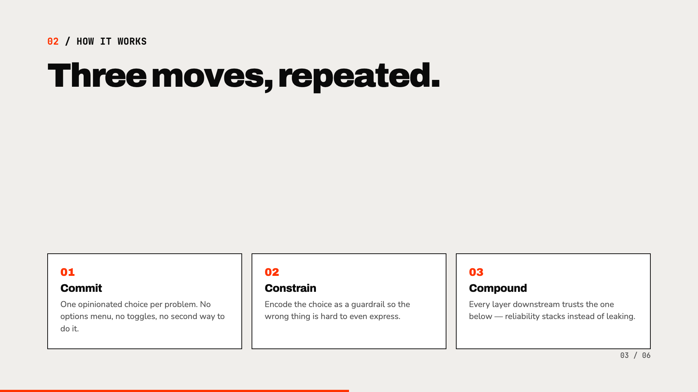
  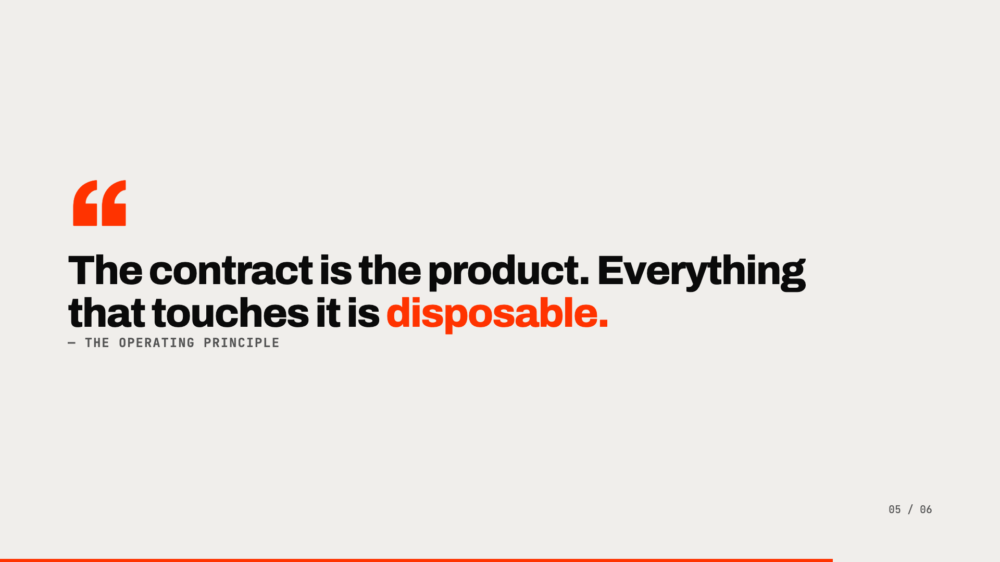
</p>

> Swiss/Bauhaus deck system with hot-red accents, hard technical boxes, and numbered mono eyebrows.

### Duolingo Learn

<p>
  
  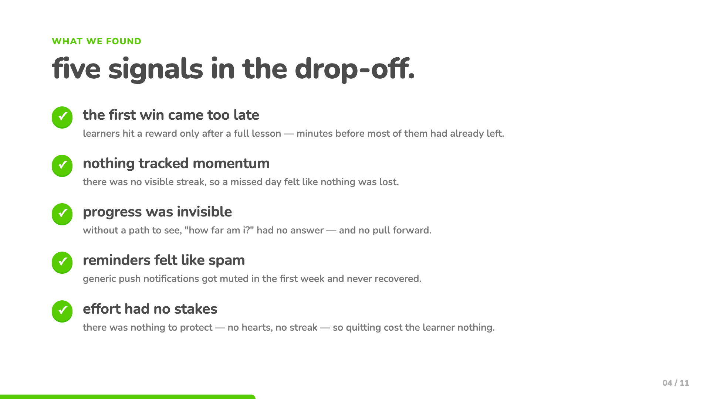
  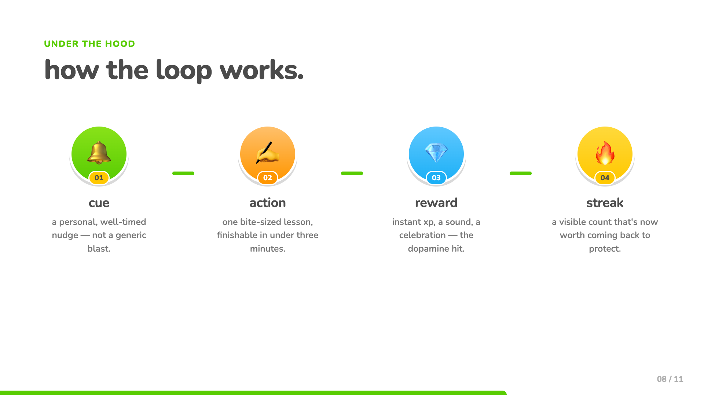
</p>

> Bright gamified learning deck with rounded type, chunky 3D buttons, lesson paths, XP pills, and green-checkmark bullets.

### Stagehand Dev

<p>
  
  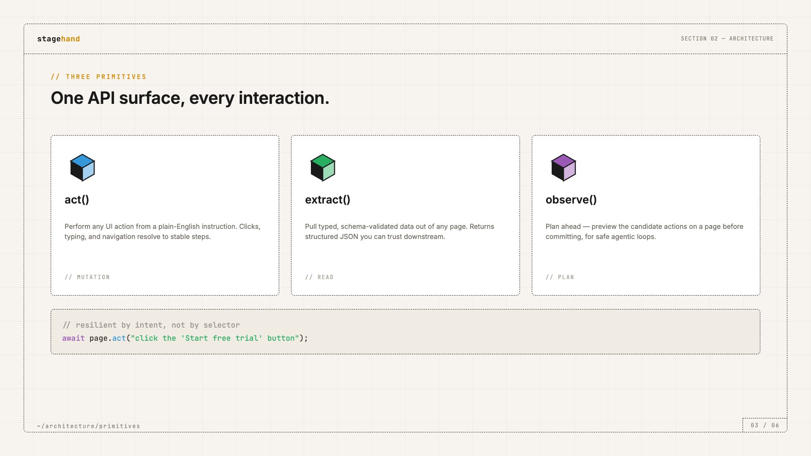
  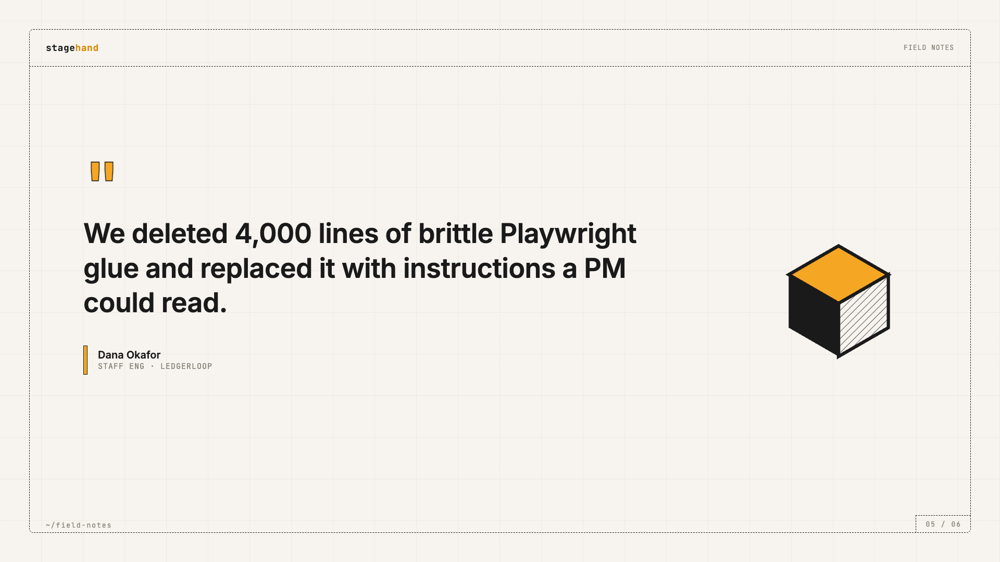
</p>

> Dev-tools landing-page system with graph-paper structure, dashed borders, one golden-yellow accent, and isometric cubes.

### Hedgehog OS

<p>
  
  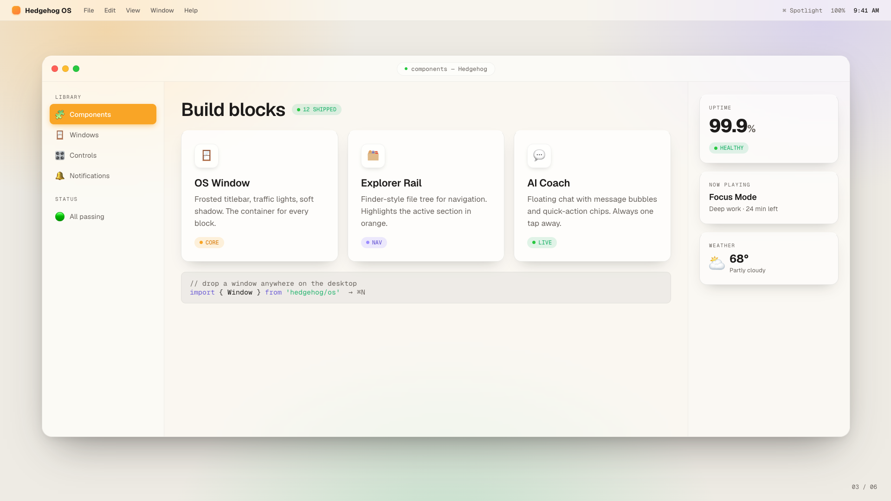
  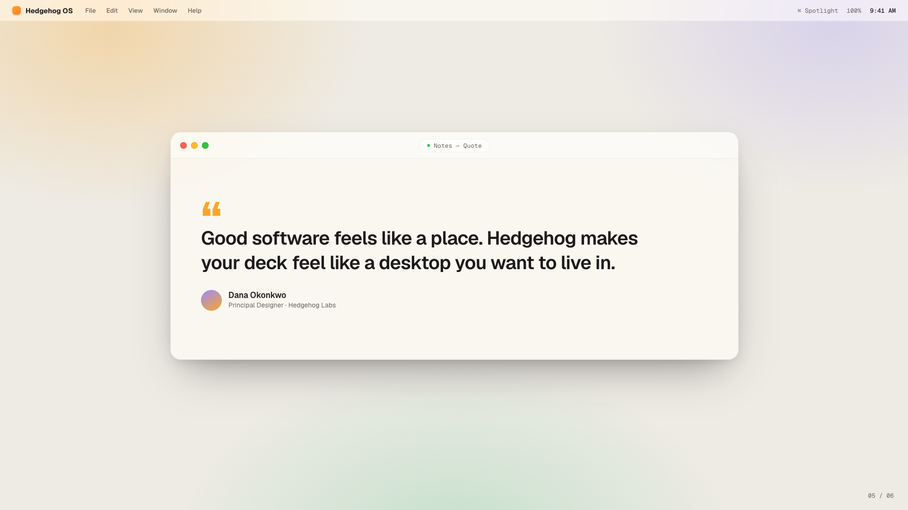
</p>

> Warm macOS-inspired glassmorphism with frosted app windows, Finder-style navigation, glass widgets, and friendly orange accents.

### Voltcast

<p>
  
  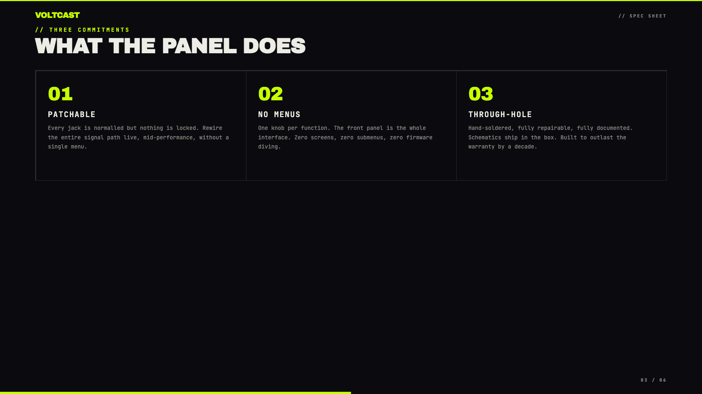
  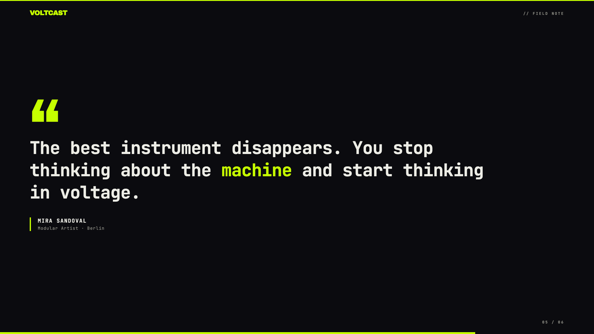
</p>

> Acid-green-on-black brutalist hardware-spec deck with hard grids, mono readouts, and zero rounded corners.

### Twenty SaaS

<p>
  
  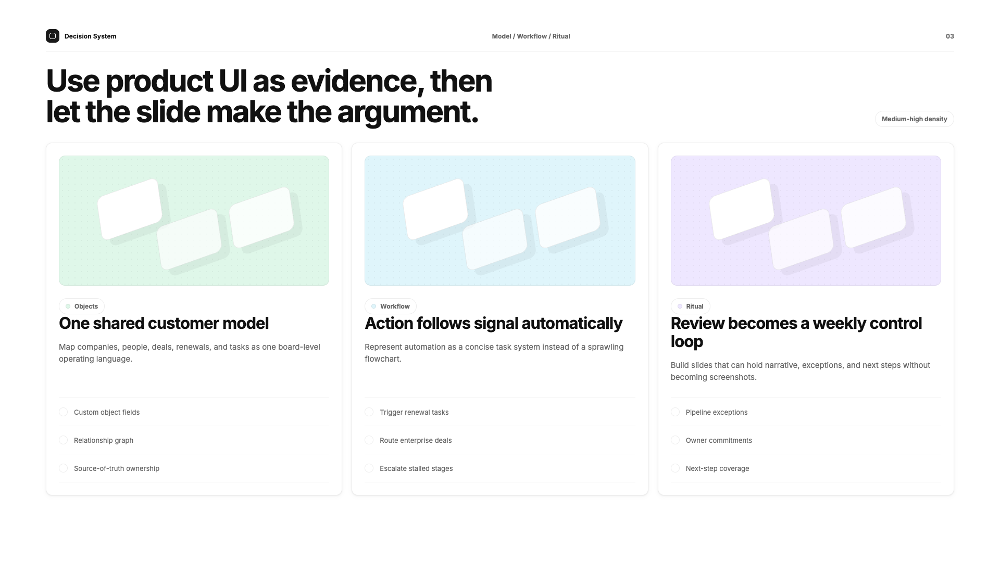
  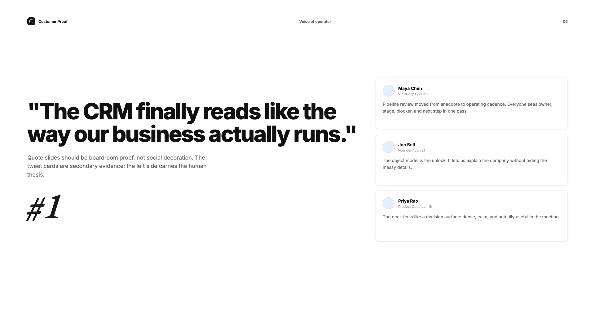
</p>

> Refined high-density SaaS operating deck with monochrome Inter boardroom surfaces, EB Garamond italic accents, thin deck chrome, decision grids, dark stat panels, proof stacks, rollout roadmaps, and pastel artifact cards.

## Additional Bold Templates

Frontend Slides can also draw from 34 optional bold design systems from
[`beautiful-html-templates`](https://github.com/zarazhangrui/beautiful-html-templates),
including editorial, brutalist, retro, cyber, and professional deck styles.

The full upstream gallery is intentionally not duplicated here. Browse the
source templates and screenshots in
[`beautiful-html-templates/templates`](https://github.com/zarazhangrui/beautiful-html-templates/tree/main/templates)
or inspect this repo's compact metadata at
[`bold-template-pack/selection-index.json`](bold-template-pack/selection-index.json).

## Architecture

This skill uses **progressive disclosure** — the main `SKILL.md` is a workflow map, with supporting files loaded on-demand only when needed:

| File                      | Purpose                        | Loaded When               |
| ------------------------- | ------------------------------ | ------------------------- |
| `SKILL.md`                | Core workflow and rules        | Always (skill invocation) |
| `STYLE_PRESETS.md`        | 12 curated visual presets      | Phase 2 (style selection) |
| `bold-template-pack/selection-index.json` | Compact bold template metadata for candidate selection | Phase 2 (style selection) |
| `bold-template-pack/templates/*/preview.md` | Tiny style cards for shortlisted bold previews | Phase 2 after shortlisting |
| `bold-template-pack/templates/*/design.md` | Full design system for the selected bold template | Phase 3 after user selection |
| `kj-template-pack/selection-index.json` | Compact KJ template metadata for candidate selection | Phase 2 (style selection) |
| `kj-template-pack/templates/*/preview.md` | Tiny style cards for shortlisted KJ previews | Phase 2 after shortlisting |
| `kj-template-pack/templates/*/design.md` | Full design system for the selected KJ template | Phase 3 after user selection |
| `viewport-base.css`       | Mandatory fixed-stage CSS      | Phase 3 (generation)      |
| `html-template.md`        | HTML structure and JS features | Phase 3 (generation)      |
| `animation-patterns.md`   | CSS/JS animation reference     | Phase 3 (generation)      |
| `scripts/extract-pptx.py` | PPT content extraction         | Phase 4 (conversion)      |
| `scripts/deploy.sh`       | Deploy to Vercel               | Phase 6 (sharing)         |
| `scripts/export-pdf.sh`   | Export slides to PDF           | Phase 6 (sharing)         |

Maintenance-only source metadata and regeneration helpers live outside the
user-facing skill package. Normal users do not need them.

This design follows agent-skill best practices: give the agent a map first,
then reveal only the specific files needed for the current choice.

## Philosophy

This skill was born from the belief that:

1. **You don't need to be a designer to make beautiful things.** You just need to react to what you see.

2. **Dependencies are debt.** A single HTML file will work in 10 years. A React project from 2019? Good luck.

3. **Generic is forgettable.** Every presentation should feel custom-crafted, not template-generated.

4. **Comments are kindness.** Code should explain itself to future-you (or anyone else who opens it).

## Sharing Your Presentations

After creating a presentation, the skill offers two ways to share it:

### Deploy to a Live URL

One command deploys your slides to a permanent, shareable URL that works on any device — phones, tablets, laptops:

```bash
bash scripts/deploy.sh ./my-deck/
# or
bash scripts/deploy.sh ./presentation.html
```

Uses [Vercel](https://vercel.com) (free tier). The skill walks you through signup and login if it's your first time.

### Export to PDF

Convert your slides to a PDF for email, Slack, Notion, or printing:

```bash
bash scripts/export-pdf.sh ./my-deck/index.html
bash scripts/export-pdf.sh ./presentation.html ./output.pdf
```

Uses [Playwright](https://playwright.dev) to screenshot each slide at 1920×1080 and combine into a PDF. Installs automatically if needed. Animations are not preserved (it's a static snapshot).

## Requirements

- A local coding agent with filesystem access and the ability to run shell commands
- Claude Code is required only for the custom marketplace-source install and `/frontend-slides:frontend-slides` command
- For PPT conversion: Python with `python-pptx` library
- For URL deployment: Node.js + Vercel account (free)
- For PDF export: Node.js (Playwright installs automatically)

## Credits

Created by [@zarazhangrui](https://github.com/zarazhangrui). This fork — adding the `kj-template-pack` — is maintained by [@kev-hu](https://github.com/kev-hu).

## License

MIT — Use it, modify it, share it.
